# Skin Lesion Classification MLOps Pipeline

[](https://www.python.org/)
[](https://aws.amazon.com/sagemaker/)
[](https://www.terraform.io/)
[](https://pytorch.org/)
[](LICENSE)
[](https://github.com/yourusername/skin-lesion-classification)

A production-ready MLOps pipeline for detecting melanoma and other skin cancers using AWS SageMaker, with automated retraining, monitoring, and deployment.

## 🎯 Project Overview

This project demonstrates **end-to-end MLOps practices** for healthcare computer vision, showcasing the transition from DevOps to MLOps with production-grade implementations.

### ✨ Key Features

| Feature | Description |
| ------- | ----------- |
| 🏗️ **Infrastructure as Code** | Complete AWS infrastructure provisioned with Terraform |
| 🔄 **Automated ML Pipeline** | SageMaker Pipelines for reproducible workflows |
| 🚀 **Auto-Scaling Deployment** | Production endpoints with 1-5 instance auto-scaling |
| 📊 **Continuous Monitoring** | Data drift & model quality monitoring |
| 🔁 **Automated Retraining** | Triggered by drift detection, schedule, or manually |
| 💰 **Cost Optimized** | Spot instances, S3 tiering, auto-scaling |
| 🔒 **Security First** | KMS encryption, IAM roles, VPC isolation |
| 🧪 **CI/CD Pipeline** | GitHub Actions for automated testing & deployment |
| 📈 **Model Registry** | Version-controlled model artifacts |
| 🏥 **Healthcare Focus** | HIPAA-compliant architecture for medical imaging |

### 🛠️ Technologies Used

**Cloud & MLOps:**

- AWS SageMaker (Pipelines, Training, Endpoints, Model Monitor)
- AWS Step Functions & EventBridge
- Amazon S3, ECR, CloudWatch
- Terraform (Infrastructure as Code)

**ML/AI:**

- PyTorch 2.1+
- Transfer Learning (ResNet, EfficientNet, DenseNet)
- Computer Vision (Image Classification)
- Model Monitoring & Drift Detection

**DevOps:**

- GitHub Actions (CI/CD)
- Docker (Containerization)
- Python 3.10+
- Unit & Integration Testing

## Architecture

### High-Level System Architecture

```mermaid
graph TB
    subgraph "Data Ingestion"
        A[ISIC/Kaggle Dataset] --> B[S3 Raw Data Bucket]
        B --> C[Data Validation]
    end

    subgraph "SageMaker ML Pipeline"
        C --> D[Preprocessing Job]
        D --> E[Training Job<br/>GPU Instances]
        E --> F[Evaluation Job]
        F --> G{Accuracy ≥<br/>Threshold?}
        G -->|Yes| H[Model Registry]
        G -->|No| I[Notification]
    end

    subgraph "Model Deployment"
        H --> J{Manual<br/>Approval}
        J -->|Approved| K[SageMaker Endpoint]
        K --> L[Auto-scaling Group<br/>1-5 instances]
    end

    subgraph "Monitoring & Observability"
        L --> M[Model Monitor]
        M --> N[Data Quality Check]
        M --> O[Model Quality Check]
        N --> P{Drift<br/>Detected?}
        O --> P
        P -->|Yes| Q[EventBridge Trigger]
    end

    subgraph "Automated Retraining"
        Q --> R[Step Functions<br/>Workflow]
        R --> S[Check Data Availability]
        S --> T{Sufficient<br/>Data?}
        T -->|Yes| D
        T -->|No| I
    end

    subgraph "Infrastructure"
        U[Terraform IaC] -.->|Provisions| B
        U -.->|Provisions| K
        U -.->|Provisions| M
        U -.->|Provisions| R
    end

    subgraph "CI/CD"
        V[GitHub Actions] -->|Deploy| U
        V -->|Build & Push| W[ECR<br/>Docker Images]
        W -.->|Used by| E
    end

    style K fill:#4CAF50
    style M fill:#FF9800
    style R fill:#2196F3
    style U fill:#9C27B0
```



### ML Pipeline Flow


### Monitoring & Retraining Workflow


### AWS Services Used
- **Amazon S3**: Data lake for raw images, processed data, and model artifacts
- **SageMaker Pipelines**: ML workflow orchestration
- **SageMaker Training**: Distributed training with spot instances
- **SageMaker Model Registry**: Model versioning and lifecycle management
- **SageMaker Endpoints**: Real-time inference with auto-scaling
- **SageMaker Model Monitor**: Data drift and model quality monitoring
- **AWS Lambda**: Serverless compute for automation
- **AWS Step Functions**: Retraining orchestration
- **Amazon EventBridge**: Scheduled retraining triggers
- **Amazon CloudWatch**: Monitoring and alerting
- **Amazon ECR**: Container registry for custom images
- **AWS KMS**: Encryption for data security

### Infrastructure Components

```mermaid
graph LR
    subgraph "Storage Layer"
        S3_Data[S3: Raw Data]
        S3_Models[S3: Models]
        S3_Pipeline[S3: Pipeline]
        S3_Logs[S3: Logs]
    end

    subgraph "Compute Layer"
        SM_Processing[SageMaker<br/>Processing]
        SM_Training[SageMaker<br/>Training]
        SM_Endpoints[SageMaker<br/>Endpoints]
        Lambda[Lambda<br/>Functions]
    end

    subgraph "Orchestration"
        Pipeline[SageMaker<br/>Pipeline]
        StepFn[Step<br/>Functions]
        EventB[EventBridge]
    end

    subgraph "Monitoring"
        CW[CloudWatch]
        ModelMon[Model<br/>Monitor]
        SNS[SNS Topics]
    end

    subgraph "Security"
        IAM[IAM Roles]
        KMS[KMS Keys]
        VPC[VPC<br/>Optional]
    end

    subgraph "Registry"
        ECR[ECR<br/>Repositories]
        Registry[Model<br/>Registry]
    end

    Pipeline --> SM_Processing
    Pipeline --> SM_Training
    StepFn --> Pipeline
    EventB --> StepFn

    SM_Training --> S3_Models
    SM_Processing --> S3_Pipeline
    SM_Endpoints --> S3_Models

    ModelMon --> CW
    CW --> SNS
    CW --> EventB

    IAM -.->|secures| SM_Training
    IAM -.->|secures| SM_Endpoints
    KMS -.->|encrypts| S3_Data

    ECR -.->|images| SM_Training
    Registry -.->|versions| SM_Endpoints

    style Pipeline fill:#4CAF50
    style StepFn fill:#2196F3
    style ModelMon fill:#FF9800
    style KMS fill:#F44336
```

## Project Structure

```
.
├── .github/
│   └── workflows/          # GitHub Actions CI/CD pipelines
├── config/
│   ├── config.yaml         # Main configuration
│   ├── model_config.yaml   # Model hyperparameters
│   └── pipeline_config.yaml # SageMaker pipeline config
├── data/
│   ├── raw/                # Raw ISIC dataset (gitignored)
│   ├── processed/          # Processed images
│   └── features/           # Extracted features
├── infrastructure/
│   ├── terraform/          # Terraform IaC for AWS resources
│   └── cloudformation/     # Alternative CloudFormation templates
├── models/                 # Saved model artifacts (gitignored)
├── notebooks/
│   ├── 01_eda.ipynb       # Exploratory data analysis
│   ├── 02_baseline.ipynb  # Baseline model
│   └── 03_experiments.ipynb # Model experiments
├── scripts/
│   ├── download_data.py    # Download ISIC dataset
│   ├── upload_to_s3.py     # Upload data to S3
│   └── deploy_pipeline.py  # Deploy SageMaker pipeline
├── src/
│   ├── preprocessing/
│   │   ├── preprocess.py   # Image preprocessing
│   │   └── augmentation.py # Data augmentation
│   ├── training/
│   │   ├── train.py        # Training script
│   │   ├── model.py        # Model architecture
│   │   └── metrics.py      # Custom metrics
│   ├── evaluation/
│   │   ├── evaluate.py     # Model evaluation
│   │   └── metrics.py      # Evaluation metrics
│   ├── deployment/
│   │   ├── inference.py    # Inference handler
│   │   └── endpoint.py     # Endpoint configuration
│   ├── monitoring/
│   │   ├── data_quality.py # Data quality monitoring
│   │   ├── model_quality.py # Model quality monitoring
│   │   └── drift_detector.py # Drift detection
│   └── pipeline/
│       ├── pipeline.py     # SageMaker pipeline definition
│       └── steps.py        # Pipeline step definitions
├── tests/
│   ├── test_preprocessing.py
│   ├── test_training.py
│   └── test_inference.py
├── .gitignore
├── requirements.txt
├── setup.py
└── README.md
```

## Getting Started

### Prerequisites
- Python 3.8+
- AWS Account with appropriate permissions
- AWS CLI configured
- Terraform 1.0+
- Docker (for local testing)

### Installation

1. Clone the repository:
```bash
git clone <your-repo-url>
cd skin-lesion-classification
```

2. Create virtual environment:
```bash
python -m venv venv
source venv/bin/activate  # On Windows: venv\Scripts\activate
```

3. Install dependencies:
```bash
pip install -r requirements.txt
pip install -e .
```

4. Configure AWS credentials:
```bash
aws configure
```

### Data Setup

1. Download ISIC dataset:
```bash
python scripts/download_data.py --dataset isic2019 --output-dir data/raw
```

2. Upload to S3:
```bash
python scripts/upload_to_s3.py --bucket your-bucket-name
```

### Infrastructure Setup

1. Navigate to infrastructure directory:
```bash
cd infrastructure/terraform
```

2. Initialize Terraform:
```bash
terraform init
```

3. Review planned changes:
```bash
terraform plan
```

4. Deploy infrastructure:
```bash
terraform apply
```

### Deploy ML Pipeline

```bash
python scripts/deploy_pipeline.py --config config/pipeline_config.yaml
```

## Datasets

This project uses the following datasets:
- **ISIC 2019**: 25,331 dermoscopic images across 8 diagnostic categories
- **HAM10000**: 10,015 dermatoscopic images of pigmented lesions
- **BCN20000**: 19,424 dermoscopic images

## Model Training

The pipeline supports multiple CNN architectures:
- ResNet50
- EfficientNetB0-B7
- DenseNet121
- MobileNetV2

## Monitoring & Retraining

### Data Drift Detection
- Monitors input data distribution using SageMaker Model Monitor
- Alerts when drift exceeds threshold

### Model Quality Monitoring
- Tracks prediction accuracy, precision, recall
- Compares against baseline metrics

### Automated Retraining
- Triggers on data drift detection
- Scheduled monthly retraining
- Manual trigger via API

## CI/CD Pipeline

The GitHub Actions workflow includes:
- Code linting and formatting
- Unit tests
- Integration tests
- Model training on sample data
- Infrastructure validation
- Automated deployment to staging

## Cost Optimization

- Spot instances for training (up to 70% savings)
- S3 Intelligent-Tiering for data storage
- Auto-scaling for inference endpoints
- Serverless Lambda for orchestration

## Security

- Data encryption at rest (S3, EBS) using KMS
- Data encryption in transit (TLS)
- IAM roles with least privilege
- VPC isolation for SageMaker
- Secrets management with AWS Secrets Manager

## Monitoring & Alerting

CloudWatch dashboards track:
- Model accuracy, precision, recall
- Inference latency (p50, p95, p99)
- Endpoint utilization
- Training job status
- Data drift metrics
- Cost metrics

## Contributing

1. Fork the repository
2. Create feature branch (`git checkout -b feature/amazing-feature`)
3. Commit changes (`git commit -m 'Add amazing feature'`)
4. Push to branch (`git push origin feature/amazing-feature`)
5. Open Pull Request

## License

MIT License

## Contact

Your Name - your.email@example.com

Project Link: [https://github.com/yourusername/skin-lesion-classification](https://github.com/yourusername/skin-lesion-classification)

## Acknowledgments

- ISIC Archive for providing the dataset
- AWS SageMaker team for excellent documentation
- Open source computer vision community
